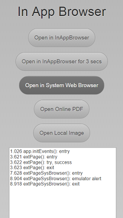

InAppBrowser Tutorial
=====================

This sample app shows how to use the following Cordova\* InAppBrowser API methods:

- `addEventListener()`: Adds a listener for an event from the InAppBrowser.

- `window.open()`: Opens a new browser window. For Android devices, opens the
  default browser. For iOS devices, opens the InAppBrowser.

- `window.close()`: Closes the InAppBrowser window.

Sample Contents
---------------

The app illustrates opening a webpage in InAppBrowser, Open a webpage and
closing it in 3 seconds using the `close()` method, opening a webpage in system
browser, opening an online PDF file and opening a local image file.

Important App Files
-------------------

`js/init-app.js` - The initialization place for your code. App init point
  (runs on custom app.Ready event from xdk/init-dev.js). Runs after underlying
  device native code and the webview is ready.

`js/app.js` - Contains methods that bind the buttons click events to the
  proper handler.

Here is an example method to open a webpage in the system web browser:

    function extPageSysBrowser() {
    "use strict";
    var fName = "extPageSysBrowser():";
    console.log(fName, "entry");
    try {
        if (window.tinyHippos) {
            emulatorAlert();
            console.log(fName, "emulator alert");
        } else {
            var ref = window.open('http://html5test.com', '_system', 'location=yes');
            console.log(fName, "try, success");
        }
    } catch (e) {
        console.log(fName, "catch, failure");
    }

    console.log(fName, "exit");
    }